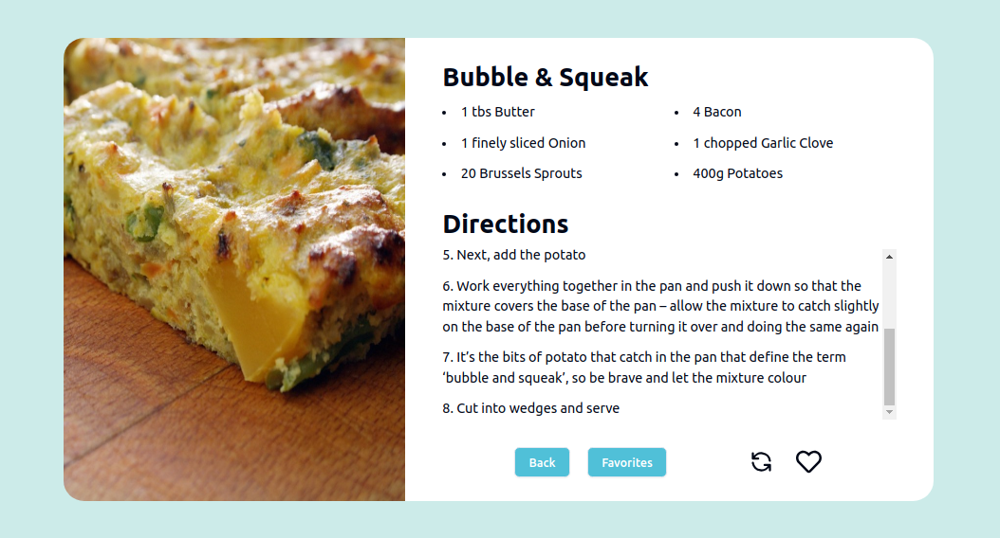

# Recipe Generator App

## 🔥 Introdução

Resolução de um desafio do [Web Dev Daily](https://www.webdevdaily.io/), usando a api do [The MedalDB](https://www.themealdb.com/api.php).

Na aplicação desenvolvida você pode:

- Acessar pelo celular ou desktop
- Navegar por diversas receitas aleatórias
- Visualizar receitas anteriores
- Adicionar quantas receitas quiser nas receitas favoritas


### 🔨 Guia de instalação

Etapas para instalar:

Passo 1:
```
git clone https://github.com/Darlan0307/App-Contries.git
```
Passo 2:
```
npm install
```
Passo 3:
```
npm run dev
```


## 📦 Tecnologias usadas:


* 
* 
* 
* 


## 💡 Social

* Link para o seu linkedin [Meu linkedin](https://www.linkedin.com/in/darlan-martins-8a7956259/)